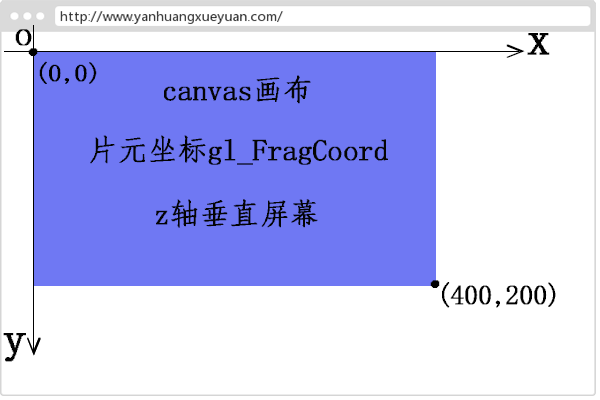

# 内置变量
以下介绍为常见的内置变量

- 顶点着色器变量
  - gl_PointSize：float，点渲染模式，方形点区域渲染像素大小
  - gl_Position：vec4，顶点位置坐标
- 片元着色器变量
  - gl_FragColor：vec4，片元颜色值
  - gl_FragCoord：vec2，片元坐标，单位像素
  - gl_PointCoord：vec2，点渲染模式对应点像素坐标
  - gl_FrontFacing


## gl_PointSize
当 WebGL 执行绘制函数 `gl.drawArrays()` 绘制模式是点模式 `gl.POINTS` 的时候，顶点着色器语言 main 函数中才会用到内置变量 `gl_PointSize`，使用内置变量 `gl_PointSize` 主要是用来设置顶点渲染出来的方形点像素大小。

```
void main() {
  //给内置变量 gl_PointSize 赋值像素大小，注意值是浮点数
  gl_PointSize = 20.0;
}
/*-------------------*/
//绘制函数绘制模式：点 gl.POINTS
gl.drawArrays(gl.POINTS, 0, 点数量);
```


## gl_Position
`gl_Position` 内置变量主要和顶点相关，出现的位置是顶点着色器语言的main函数中。
`gl_Position` 内置变量表示最终传入片元着色器片元化要使用的顶点位置坐标。
`逐顶点`：如果有多个顶点，可以理解为每个顶点都要执行一遍顶点着色器主函数 main 中的程序。

### 顶点数据传递
`attribute` 声明的顶点变量数据如何通过 javascript 的 WebGL API 批量传递所有顶点数据。

```
<script>
    //初始化着色器
    var program = initShader(...);
    //获取顶点着色器的位置变量apos，即aposLocation指向apos变量。
    var aposLocation = gl.getAttribLocation(program,'apos');

    //类型数组构造函数Float32Array创建顶点数组
    var data = new Float32Array([0.5,0.5,-0.5,0.5,-0.5,-0.5,0.5,-0.5]);

    // 创建缓冲区对象
    var buffer=gl.createBuffer();
    // 绑定缓冲区对象,激活buffer
    gl.bindBuffer(gl.ARRAY_BUFFER,buffer);
    // 顶点数组data数据传入缓冲区
    gl.bufferData(gl.ARRAY_BUFFER,data,gl.STATIC_DRAW);
    // 缓冲区中的数据按照一定的规律传递给位置变量apos
    gl.vertexAttribPointer(aposLocation,2,gl.FLOAT,false,0,0);
    // 允许数据传递
    gl.enableVertexAttribArray(aposLocation);
...
</script>
```


## gl_FragColor
`gl_FragColor` 内置变量主要用来设置片元像素的颜色，出现的位置是片元着色器语言的 main 函数中。
`gl_FragColor` 的值是思维向量 `vec4(r, g, b, a)`，前三个参数表示片元像素颜色值 RGB，第四个参数是片元像素透明度 A（0.0 ~ 1.0）。
`逐片元`：顶点经过片元着色器片元化以后，得到一个个片元，或者说像素点，然后通过内置变量gl_FragColor给每一个片元设置颜色值，所有片元可以使用同一个颜色值，也可能不是同一个颜色值，可以通过特定算法计算或者纹理像素采样。

根据片元位置设置渐变色
```
void main() {
  // 片元沿着x方向渐变
  gl_FragColor = vec4(gl_FragCoord.x / 500.0 * 1.0,1.0,0.0,1.0);
}
```

纹理采样
```
// 接收插值后的纹理坐标
varying vec2 v_TexCoord;
// 纹理图片像素数据
uniform sampler2D u_Sampler;
void main() {
  // 采集纹素，逐片元赋值像素值
  gl_FragColor = texture2D(u_Sampler,v_TexCoord);
}
```


## gl_PointCoord
如果你想了解内置变量 gl_PointCoord 表示的坐标含义，就需要了解 WebGL 绘制函数 gl.drawArrays() 的绘制模式参数 gl.POINTS。

绘制函数 gl.drawArrays() 绘制模式参数设置为点渲染模式 gl.POINTS，WebGL 会把顶点渲染为一个方形区域，在顶点着色器代码中可以通过内置变量 gl_PointSize 设置顶点渲染的方向区域像素大小。

一个顶点渲染为一个方形区域，每个方形区域可以以方向区域的左上角建立一个直角坐标系，然后使用内置变量 gl_PointCoord 描述每个方形区域中像素或者说片元的坐标，比如方形区域的左上角坐标是 (0.0,0.0),每个方形区域几何中心坐标是 (0.5,0.5)，右下角坐标是 (1.0,1.0)。

注意内置变量 gl_PointCoord 和 gl_FragCoord 表示的像素坐标含义不同, 

[详见示例](../webgl/17.WebGL-%E6%B8%B2%E6%9F%93%E7%82%B9%E7%89%87%E5%85%83%E5%9D%90%E6%A0%87%20gl_PointCoord.html)


## gl_FragCoord
内置变量 gl_FragCoord 表示 WebGL 在 canvas 画布上渲染的所有片元或者说像素的坐标，坐标原点是 canvas 画布的左上角，x 轴水平向右，y 竖直向下，gl_FragCoord 坐标的单位是像素，gl_FragCoord 的值是 vec2(x,y), 通过 gl_FragCoord.x、gl_FragCoord.y 方式可以分别访问片元坐标的纵横坐标，

[详见示例](../webgl/18.WebGL-%E7%89%87%E5%85%83%E5%9D%90%E6%A0%87%20gl_FragCoord.html)